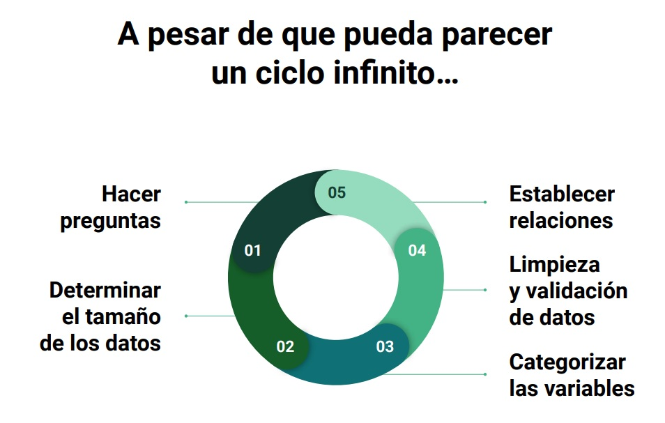
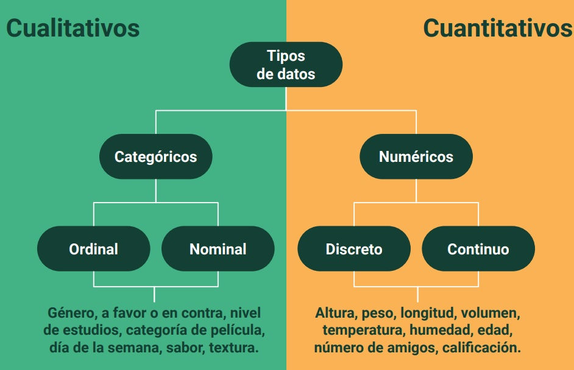

# Analisis-Exploratorio-de-los-datos
Curso de Análisis Exploratorio de Datos
# Temas
 * [Porqué hacer un análisis exploratorio de los datos?](#1')
 * [Pasos para realizar un análisis exploratorio de los datos](#2)
 * [Tipos de datos](#3)
 * [Análisis de variables](#4)
## Porqué hacer un análisis exploratorio de los datos? 

1. - Podemos organizar y entender las variables
2. - Se establece las relaciones entre variables
3. - Puedes encontrar patrones ocultos en los datos
4. - Ayuda a escoger al modelo correcto para la necesidad correcta
5. - Tomas decisiones informadas

## Pasos para realizar un análisis exploratorio de los datos

1. - Hacer Preguntas
    * Que te gustaria encontrar?
    * Que quisieras saber de los datos?
    * Cuál es la razón para realizar el análisis?

2. - Determinar el tamaño de los datos
    * Cuantas observaciones existen?
    * Cuantas variables hay?
    * Necesito todas las observaciones?
    * Necesito todas las variables?

3. - Categorizar las variables
    * Cuántas variables categóricas existen?
    * Cuántas variables continuas existen?
    * Como puedo explorar cada variable dependiendo de su categoría?

4. - Limpieza y validación de los datos
    * Tengo valores faltantes?
    * Cuál es la proporción de datos faltantes?
    * Como puedo tratar a los datos faltantes?
    * Cuál es la distribución de los datos?
    * Tengo valores atípicos?

5. - Establecer relaciones
    * Existe algún tipo de relación entre mi variable X y Y?
    * Qué pasa si ahora considero a la variable Z en el análisis?
    * Qué significa que las observaciones se agrupen?
    * Qué significa el patrón que se observa?

## Tipos de datos

## Análisis de variables

